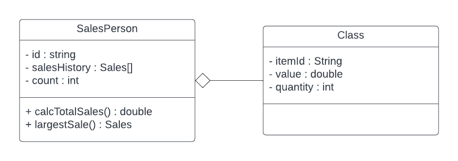
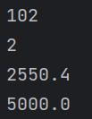

# Forum Week 9 - OOP

Lenno Aubert Hartono - 2602116983 - L2AC


**A large company with locations in different cities has taken an OOP approach in creating an administration program that manages all aspects of its business. These aspects include:**

**- the sale of all the different products that the company manages**

**- the salaries for managers, office staff and sales personnel.**


##### 1. (a) By making use of an example from the above scenario, distinguish between a class and an instantiation of a class.

In object-oriented programming, a class is a blueprint or template for creating objects of a certain type. It defines the attributes and methods that the objects will have. For example, in the company's administration program, there might be a class called "Employee" that defines the attributes and methods that all employees in the company will have, such as their name, ID number, and salary.

An instantiation of a class, on the other hand, is an actual object that is created from a class. It has its own set of attributes and can use the methods defined in the class. Continuing with the example of the "Employee" class, an instantiation of that class might be an object representing a specific employee in the company, such as "Dono" with an ID number of 12131 and a salary of Rp60,000,000.00 per year.


##### The different modules in the program each open a graphical user interface (GUI). Each GUI has a similar design but contains differences specific to each module.

##### (b) By giving two examples, explain how the principles of inheritance can be incorporated into the design of this administration program.

Inheritance is a key principle of object-oriented programming that allows classes to inherit attributes and methods from other classes. In the company's administration program, inheritance could be used in the following ways:

1. A "Manager" class could inherit from the "Employee" class, since managers are a type of employee with additional attributes and methods. The Manager class would have its own specific attributes and methods, but would also inherit the general attributes and methods of the Employee class, such as name and salary. 
2. Similarly, a "Salesperson" class could inherit from the "Employee" class, since salespeople are also a type of employee with specific attributes and methods related to their job. This would allow for easier management of the different types of employees in the company. 


##### (c) Describe how the use of libraries can facilitate the development of programs like this company’s administration program.

Libraries are pre-existing collections of code that can be used to speed up the creation of programs like the company's administration program. Developers can use libraries to handle common tasks or functions, such as displaying a graphical user interface or carrying out complex calculations, rather than developing all of the code from start.

Using libraries in the context of the administration program could aid in streamlining development and increasing productivity. For instance, rather than writing unique code for each module, the program's various modules may be created using a GUI library. The complex salary calculations for various personnel in the organization could be handled using a library for financial computations. Instead of reinventing the wheel for routine operations, developers can use libraries to save time and resources and concentrate on the distinctive features of the software.


##### 2. The company employs several sales personnel to sell its products to different retailers. Each branch of the company keeps track of its own sales with a suite of programs that include the two classes SalesPerson and Sales.

```JAVA
public class SalesPerson {

	// each object contains details of one salesperson

	private String id;

	private Sales[] salesHistory; // details of the different sales

	private int count = 0; // number of sales made


	//constructor for a new salesperson

	public SalesPerson(String id){

	// code missing

	}

 

	// constructor for a salesperson transferred (together with their sales details) from another branch

	public SalesPerson(String id, Sales[] s, int c){

	// code missing

	}

 

	public int getCount(){return count;}

	public String getId() {return id;}

	public void setSalesHistory(Sales s){

	salesHistory[count] = s;

	count = count +1;

	}

 

	public double calcTotalSales(){

	// calculates total sales for the salesperson

	// code missing

	}

 

	public Sales largestSale(){

	// calculates the sale with the largest value

	// code missing

	}

}
```


##### Each instance variable is initialized when a SalesPerson object is instantiated.

##### (a) Complete the constructor public SalesPerson(String id), from the SalesPerson class.

```java
public SalesPerson(String id) {
    id = this.id;
    this.salesHistory = new Sales[100];
}
```


##### (b) Explain why accessor methods are necessary for the SalesPerson class. (3 points)

Most attributes in a class are private to prevent direct access to the attribute. To get the private attribute we use the accessor method.


```java
public class Sales {

	// each object contains details of one sale

	private String itemId;     // id of the item

	private double value;      // the price of one item

	private int quantity;      // the number of the items sold

	// constructor missing

	public double getValue() {
        return value;
    }

	public int getQuantity() {
        return quantity;
    }
    
}
```


##### (c) (i) Construct unified modelling language (UML) diagrams to clearly show the relationship between the SalesPerson and Sales classes.

##### Note: There is no need to include mutator or accessor methods or a constructor.




##### (c) (ii) Outline a negative effect that a future change in the design of the Sales object might have on this suite of programs.

If changes are made in the SalesPerson class, the Sales class also have to be changed to make it compatible, for example in the calcTotalSales method where it relies on the Sales class.


##### The company employs several sales personnel. The different salesPerson objects are held in the array salesPeople. The Driver class contains various methods that operate on the SalesPerson and Sales classes. The Driver class contains the following code:

```java
public static void main(String[] args){

    SalesPerson[] salesPeople = new SalesPerson[6];

    salesPeople[0] = new SalesPerson("100");

    salesPeople[1] = new SalesPerson("101");

    salesPeople[2] = new SalesPerson("102");

    salesPeople[0].setSalesHistory(new Sales("A100",300.00,10));

    salesPeople[0].setSalesHistory(new Sales("A200",1000.00,2));

    salesPeople[1].setSalesHistory(new Sales("A300",2550.40,10));

    System.out.println(salesPeople[2].getId());

    System.out.println(salesPeople[0].getCount());

    System.out.println(salesPeople[1].getSalesHistory(0).getValue());

    System.out.println(salesPeople[0].calcTotalSales());

 }
```


##### (d) State the output after running this code.




##### (e) Construct the method calcTotalSales(), in the SalesPerson class that calculates the total value of the sales for a specific SalesPerson object.

```java
public double calcTotalSales(){
    // calculates total sales for the salesperson
    double total = 0;

    for(int i = 0; i<count; i++){
        total+=salesHistory[i].getValue() * salesHistory[i].getQuantity();
    }
    return total;
}
```


##### The salesPeople array contains 100 instantiated objects. The company wishes to reward the salesperson whose sales have the largest total value.

##### (f) By making use of any previously written methods, construct the method highest(), that returns the ID of the salesperson whose sales have the largest total value.

```java
public static String highest(SalesPerson[] salesPeople) {
    double highest = 0;
    String salesId = "";

    for (SalesPerson salesPerson : salesPeople) {
        if (salesPerson != null && salesPerson.calcTotalSales() > highest) {
            highest = salesPerson.calcTotalSales();
            salesId = salesPerson.getId();
        }
    }
    return salesId;
}
```


##### (g) Construct the method addSales(Sales s, String id), in the Driver class, that will add a new Sales object s, to the salesperson with a specified ID.

##### Note: You can assume that the ID is a valid one.

```java
static SalesPerson[] salesPeople;

public static void addSales(Sales s, String id) {
    //add a new Sales object s, to the salesPerson with a specified ID (valid ID)
    for (SalesPerson salesPerson : salesPeople) {
        if (salesPerson != null && salesPerson.getId().equals(id)) {
            salesPerson.setSalesHistory(s);
            return;
        }
    }
}
```


##### A further class in this suite of programs is the Payroll class. This class is run at the end of each month to calculate each salesperson’s salary, which is based on the sales that have been made during that month.

##### (h) Suggest changes that must be made to the SalesPerson class and/or the Sales class to allow these calculations to be made.

In the Sales class, we can add date variable along with its getter and setter. Due to the date variable being used in the method, this will have an impact on the CalcTotalSales function.


##### (i) Discuss the use of polymorphism that occurs in this suite of programs.

It uses polymorphism, since there are 2 constructor with different parameter used in the SalesPerson class.